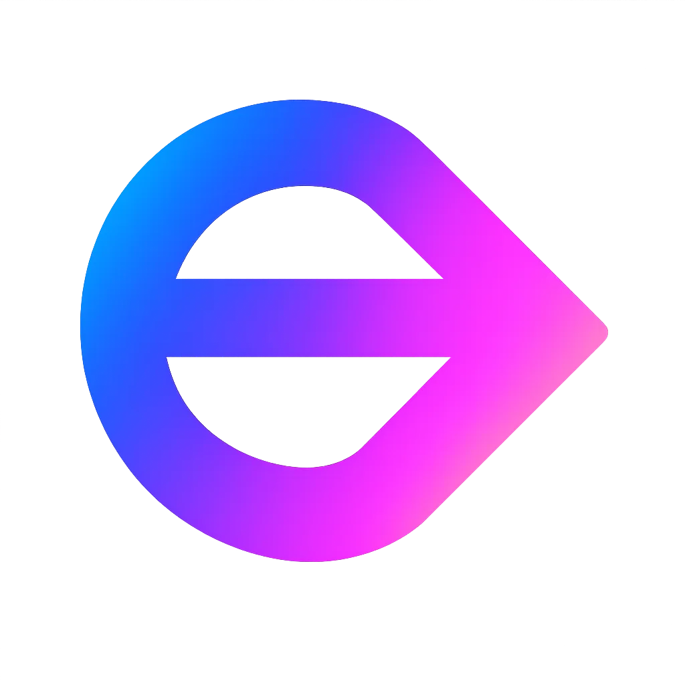

<p align="center">
  
</p>

# Build with Ekstra

`build-with-ekstra` is the public developer starter repo for Ekstra.OS.

Ekstra lets developers add motion-native input to web products using phones, cameras, XR devices, and other motion providers. This repository is the external-facing surface for getting started: docs, supported starters, reference integrations, and the browser control-profile package.

The current public wedge is browser-first. The broader platform model is provider-to-receiver: motion and motion-relevant state can eventually be routed from people, machines, environments, and public live feeds into applications, automations, devices, and other valid receivers.

It is not the full internal runtime source tree.

## What You Can Build Today

- browser experiences controlled by a phone with no native app install
- motion-aware websites and dashboards driven by `motion.samples`
- gesture-driven web interactions built on top of Ekstra composition and routing
- supported pointer and presentation workflows plus preview control profiles for kiosk, media, and 3D navigation

## Start In 10 Minutes

The fastest path is the hosted sandbox.

1. Try the live hosted demo.
2. Clone this repo.
3. Serve [`starters/web-phone-pointer/`](starters/web-phone-pointer/) or [`starters/presentation-remote/`](starters/presentation-remote/).
4. Replace the demo UI or motion semantics with your own product behavior.

Immediate live demo:

```text
https://ekstra.ai/build-with-ekstra/demo
```

Quickstart:

```powershell
git clone https://github.com/imxdemetri/build-with-ekstra
cd build-with-ekstra\starters\web-phone-pointer
python -m http.server 18080
```

Then open:

```text
http://127.0.0.1:18080/index.html
```

When a supported starter is served from `localhost` or `127.0.0.1`, it automatically targets the hosted `ekstra.ai` sandbox unless you override the endpoints.

Start with [`docs/start-here.md`](docs/start-here.md) for the full flow.

Before integrating against the hosted preview, read:

- [`docs/public-contract.md`](docs/public-contract.md)
- [`docs/support-status.md`](docs/support-status.md)

## Live Public Surfaces

- Developer landing: `https://ekstra.ai/build-with-ekstra`
- Live demo: `https://ekstra.ai/build-with-ekstra/demo`
- Phone controller: `https://ekstra.ai/build-with-ekstra/controller`
- Hosted WebSocket bridge: `wss://ekstra.ai/ws`
- Phone ingest: `https://ekstra.ai/api/phone-imu/ingest`
- GitHub wiki: `https://github.com/imxdemetri/build-with-ekstra/wiki`
- GitHub project board: `https://github.com/users/imxdemetri/projects/1`

## Supported Now vs Preview vs Planned

Supported now:
- hosted sandbox runtime for evaluation and prototype work
- `web-phone-pointer` starter
- `presentation-remote` starter
- documented browser bridge and phone IMU ingest contract
- public docs, GitHub Pages, and wiki

Preview now:
- published `@ekstraai/controls-web` preview package
- public control profile catalog beyond the two supported starters
- same-domain `ekstra.ai` developer routes and hosted demo flow

Planned next:
- `orbit-3d` starter
- broader control-profile coverage and stable npm package releases

## Latest Package Release

- npm package: `@ekstraai/controls-web@0.1.0-preview.2`
- GitHub prerelease: `controls-web-v0.1.0-preview.2`

Install:

```bash
npm install @ekstraai/controls-web@preview
```

## Platform Model

Ekstra is one platform with multiple developer surfaces:

- `Ekstra Runtime`
  - the motion OS layer that ingests, normalizes, routes, and distributes motion data
- `Ekstra Controls`
  - reusable control profiles such as pointer, presentation, and 3D navigation
- `Starters`
  - reference application slices developers can copy and adapt

For the broader platform vision beyond the current web-first public wedge, see the wiki:

- `https://github.com/imxdemetri/build-with-ekstra/wiki/Signals-Beyond-Human-Input`

For browser developers, the important runtime path is:

```text
Phone browser -> phone_imu_provider -> motiond -> ws_bridge -> your web app
```

Optional higher-level gesture routing adds:

```text
motion.samples -> detection pipeline -> events.composition -> surface pack -> surface.actions
```

## Supported Deployment Modes

### Hosted sandbox

Best for:
- first-time developers
- design validation
- demos and prototype integrations

### Self-hosted Docker

Best for:
- production pilots
- private networks
- custom providers and connectors
- tighter operational control

Use [`deploy/docker/`](deploy/docker/) for self-hosted runtime deployment.

## Repository Layout

```text
docs/                  External-facing documentation
starters/              Supported starter apps
packages/controls-web/ Browser control-profile package
examples/reference/    Reference integrations
deploy/docker/         Self-hosted runtime deployment manifests
site/                  GitHub Pages landing site
.github/workflows/     Public repo CI and publishing workflows
```

## Documentation

- [`docs/README.md`](docs/README.md)
- [`docs/start-here.md`](docs/start-here.md)
- [`docs/public-contract.md`](docs/public-contract.md)
- [`docs/support-status.md`](docs/support-status.md)
- [`docs/concepts.md`](docs/concepts.md)
- [`docs/architecture.md`](docs/architecture.md)
- [`docs/hosted-sandbox.md`](docs/hosted-sandbox.md)
- [`docs/self-hosted-docker.md`](docs/self-hosted-docker.md)
- [`docs/control-profiles.md`](docs/control-profiles.md)
- [`docs/presentation-remote.md`](docs/presentation-remote.md)
- [`docs/web-phone-pointer.md`](docs/web-phone-pointer.md)
- [`CHANGELOG.md`](CHANGELOG.md)
- [`docs/faq.md`](docs/faq.md)

## Community and Support

- Support: [`SUPPORT.md`](SUPPORT.md)
- Security policy: [`SECURITY.md`](SECURITY.md)
- Contribution guide: [`CONTRIBUTING.md`](CONTRIBUTING.md)
- Email: `info@ekstra.ai`
- Telegram: `https://t.me/ekstraai`
- X: `https://x.com/ekstraai`
- Discord: coming soon

## Status

Ekstra is currently in early public developer preview. The hosted sandbox is intended for evaluation and prototyping, not for production SLA commitments. The current supported public wedge is the browser phone IMU flow across pointer and presentation starters, with broader profiles and modalities exposed more cautiously as preview or directional surfaces.

